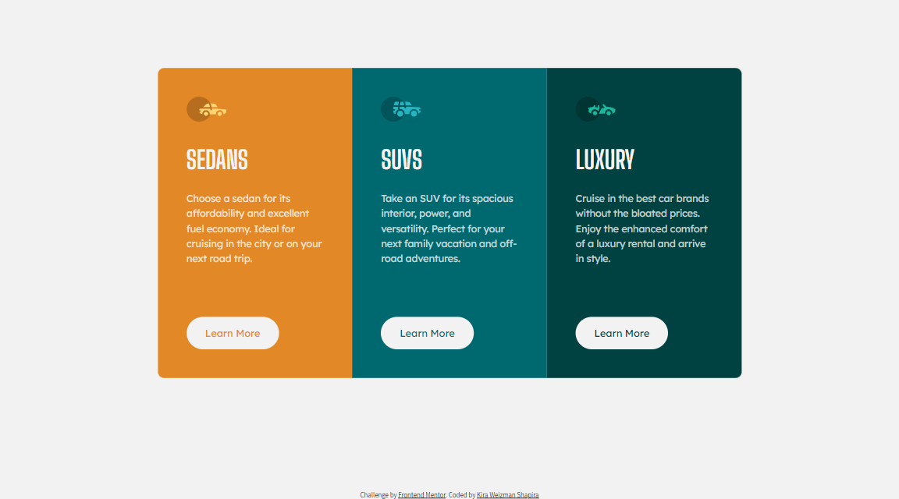

# Frontend Mentor - 3-column preview card component

### Welcome! 👋

Thanks for checking my solution code to the [3-column preview card component challenge on Frontend Mentor](https://www.frontendmentor.io/challenges/3column-preview-card-component-pH92eAR2-).

At my learning process I learned how to use in nth-child in stylesheet in order to use different styles instead creating more classes.

```css
.col:nth-child(1) button {
  color: var(--bright-orange);
}

.col:nth-child(2) button {
  color: var(--dark-cyan);
}

.col:nth-child(3) button {
  color: var(--very-dark-cyan);
}
```

also I learned how to use in outline method for button activity states, because somehow, using in border method, expanded other elements size.

```css
.col .button:hover {
  background: none;
  outline: 2px solid var(--background-headings-buttons);
  color: var(--background-headings-buttons);
}
```
I'm happy to see that after 6 challenges I did, the process of coding became faster for me.



### Built with

- Semantic HTML5 markup
- CSS custom properties
- Flexbox
- CSS Grid
- Desktop-first workflow

## Author

Coded by <a href="https://www.frontendmentor.io/profile/kirawesh">@kirawesh</a>